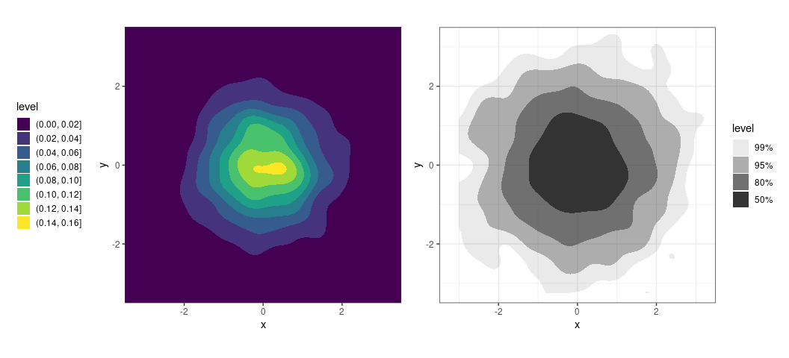
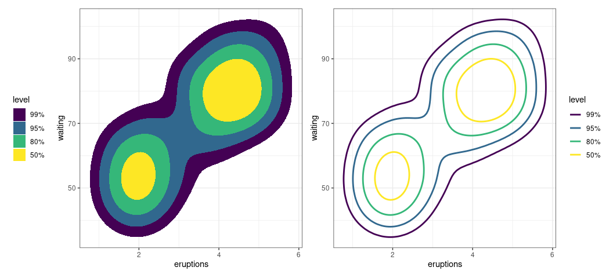

<!-- README.md is generated from README.Rmd. Please edit that file -->

# ggdensity

<!-- badges: start -->
<!-- badges: end -->

`ggdensity` extends [`ggplot2`](https://github.com/tidyverse/ggplot2)
providing more interpretable visualizations of density estimates based
on highest density regions (HDRs). `ggdensity` offers drop-in
replacements for [`ggplot2`](https://github.com/tidyverse/ggplot2)
functions:

-   `geom_hdr()` ↔ `geom_contour_2d_filled()`
-   `geom_hdr_lines()` ↔ `geom_contour_2d()`

## Installation

You can install the development version of ggdensity from
[GitHub](https://github.com/) with:

``` r
# install.packages("devtools")
devtools::install_github("jamesotto852/ggdensity")
```

## Simple Examples

#### Comparing to `geom_contour_2d`

Below, we plot density estimates of some simulated data using
`geom_density_2d_filled()` (left) and `geom_hdr()` (right). Both plots
show contours from the same density surface, but the contours plotted by
`geom_hdr()` are chosen to be informative, showing the smallest regions
containing 50%, 80%, 95%, and 99% of the estimated density (the HDRs).
This results in a very interpretable graphic, conveying more information
than arbitrary density contours.

<!-- Minor sleight-of-hand, don't want readers to worry about theme and patchwork syntax -->

``` r
df <- data.frame(x = rnorm(1000), y = rnorm(1000))

ggplot(df, aes(x, y)) + 
  geom_density_2d_filled()

ggplot(df, aes(x, y)) + 
  geom_hdr()
```



#### Grouping

Because `geom_hdr()` maps to the `alpha` aesthetic, the `fill` and
`color` aesthetics are available for mapping to variables. This allows
for easy comparison of HDRs between groups in a data set, below we
illustrate this with the `penguins` data from
[`palmerpenguins`](https://github.com/allisonhorst/palmerpenguins).

``` r
library("palmerpenguins")

ggplot(penguins, aes(flipper_length_mm, bill_length_mm, fill = species)) +
  geom_hdr() +
  geom_point(shape = 21)
```


<div style="height:40px;">

</div>

To alleviate overplotting, we can use `geom_hdr_lines()` or facet:

``` r
ggplot(penguins, aes(flipper_length_mm, bill_length_mm, color = species)) +
  geom_hdr_lines() +
  geom_point(size = .5)
```


<div style="height:40px;">

</div>

``` r
ggplot(penguins, aes(flipper_length_mm, bill_length_mm, fill = species)) +
  geom_hdr() +
  geom_point(shape = 21) +
  facet_wrap(vars(species))
```


## More Examples

#### Mapping to different aesthetics

`geom_hdr()` and `geom_hdr_lines()` map the computed variable `level` to
the `alpha` aesthetic by default. This is easy to change via
`after_stat()`, just be sure to override the `alpha` aesthetic by
setting `alpha = 1`.

<!-- Again, sleight-of-hand for legend formatting and patchwork -->

``` r
ggplot(faithful) +
  geom_hdr(aes(eruptions, waiting, fill = after_stat(level)), alpha = 1)

ggplot(faithful) +
  geom_hdr_lines(aes(eruptions, waiting, color = after_stat(level)), alpha = 1)
```



#### Different density estimators

Just like `geom_density_2d_filled()`, `geom_hdr()` allows for
visualizing kernel density estimates. It also allows for visualizing
HDRs resulting from parametric, histogram, and frequency polygon
estimates via the `method` argument. Each of these estimators offers
advantages in certain contexts. For example, histogram estimators result
in HDRs which obey constrained supports.


<!-- #### Bayesian applications -->
<!-- In the context of a Bayesian analysis, `geom_hdr()` creates plots of highest posterior regions. -->
<!-- All we need to do is give `geom_hdr()` a data frame with draws from a posterior, and  -->
