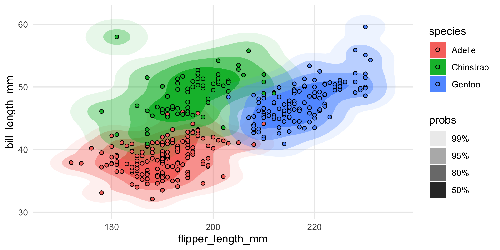
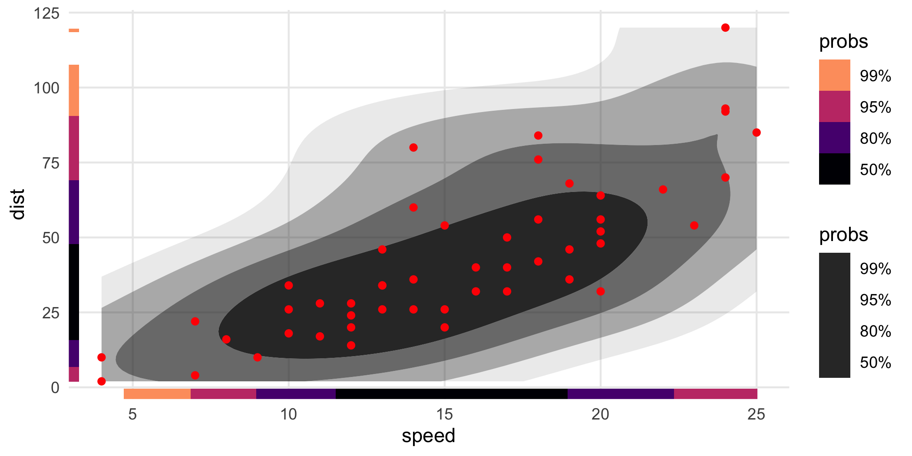
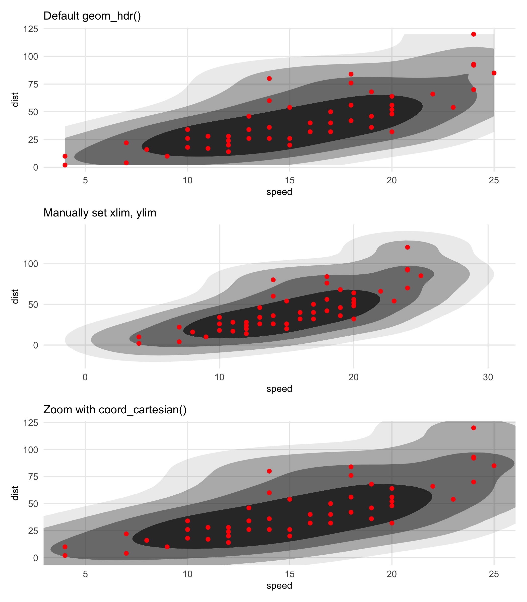
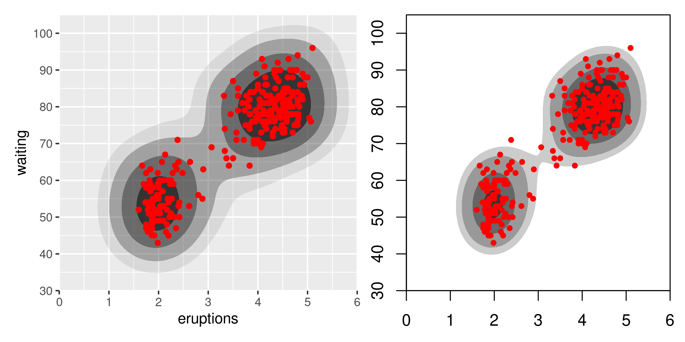

<!-- README.md is generated from README.Rmd. Please edit that file -->

# ggdensity 

<!-- badges: start -->

[](https://github.com/jamesotto852/ggdensity/actions/workflows/R-CMD-check.yaml)
[](https://app.codecov.io/gh/jamesotto852/ggdensity)
[](https://cran.r-project.org/package=ggdensity)
[](https://cran.r-project.org/package=ggdensity)
<!-- badges: end -->

**ggdensity** extends
[**ggplot2**](https://github.com/tidyverse/ggplot2) providing more
interpretable visualizations of density estimates based on highest
density regions (HDRs). **ggdensity** offers drop-in replacements for
[**ggplot2**](https://github.com/tidyverse/ggplot2) functions:

- instead of `ggplot2::geom_density_2d_filled()`, use
  `ggdensity::geom_hdr()`;
- instead of `ggplot2::geom_density_2d()`, use
  `ggdensity::geom_hdr_lines()`.

Also included are the functions `geom_hdr_fun()` and
`geom_hdr_lines_fun()` for plotting HDRs of user-specified bivariate
probability density functions.

## Installation

**ggdensity** is available on CRAN and can be installed with:

``` r
install.packages("ggdensity")
```

Alternatively, you can install the latest development version from
[GitHub](https://github.com/) with:

``` r
if (!requireNamespace("remotes")) install.packages("remotes")
remotes::install_github("jamesotto852/ggdensity")
```

## `geom_density_2d_filled()` vs. `geom_hdr()`

The standard way to visualize the joint distribution of two continuous
variables in **ggplot2** is to use `ggplot2::geom_density_2d()` or
`geom_density_2d_filled()`. Here’s an example:

``` r
library("ggplot2"); theme_set(theme_minimal())
theme_update(panel.grid.minor = element_blank())
library("ggdensity")
library("patchwork")


df <- data.frame("x" = rnorm(1000), "y" = rnorm(1000))
p <- ggplot(df, aes(x, y)) + coord_equal()
p + geom_density_2d_filled()
```


While it’s a nice looking plot, it isn’t immediately clear how we should
understand it. That’s because `geom_density_2d_filled()` generates its
contours as equidistant level sets of the estimated bivariate density,
i.e. taking horizontal slices of the 3d surface at equally-spaced
heights, and projecting the intersections down into the plane. So you
get a general feel of where the density is high, but not much else. To
interpret a contour, you would need to multiply its height by the area
it bounds, which of course is very challenging to do by just looking at
it.

`geom_hdr()` tries to get around this problem by presenting you with
regions of the estimated distribution that are immediately
interpretable:

``` r
p + geom_hdr()
```


`probs` here tells us the probability bounded by the corresponding
region, and the regions are computed to be the smallest such regions
that bound that level of probability; these are called highest density
regions or HDRs. By default, the plotted regions show the $50\%$,
$80\%$, $95\%$, and $99\%$ HDRs of the estimated density, but this can
be changed with the `probs` argument to `geom_hdr()`. Notice that your
take-away from the plot made with `geom_density_2d_filled()` is subtlely
yet significantly different than that of the plot made by `geom_hdr()`.

## Visualizing subpopulations and `geom_hdr_lines()`

**ggdensity**’s functions were designed to be seamlessly consistent with
the rest of the **ggplot2** framework. As a consequence, pretty much
everything you would expect to just work does. (Well, we hope! [Let us
know](https://github.com/jamesotto852/ggdensity/issues/new) if that’s
not true.)

For example, because `geom_hdr()` maps probability to the `alpha`
aesthetic, the `fill` and `color` aesthetics are available for mapping
to variables. You can use them to visualize subpopulations in your data.
For example, in the `penguins` data from
[**palmerpenguins**](https://github.com/allisonhorst/palmerpenguins) you
may want to look at how the relationship between bill length and flipper
length changes across different species of penguins. Here’s one way you
could look at that:

``` r
library("palmerpenguins")

ggplot(penguins, aes(flipper_length_mm, bill_length_mm, fill = species)) +
  geom_hdr(xlim = c(160, 240), ylim = c(30, 70)) +
  geom_point(shape = 21)
```



<div style="height:40px;">

</div>

Nice, but a bit overplotted. To alleviate overplotting, we can use
`geom_hdr_lines()`:

``` r
ggplot(penguins, aes(flipper_length_mm, bill_length_mm, color = species)) +
  geom_hdr_lines(xlim = c(160, 240), ylim = c(30, 70)) +
  geom_point(size = 1)
```


Or you could facet the plot:

<div style="height:40px;">

</div>

``` r
ggplot(penguins, aes(flipper_length_mm, bill_length_mm, fill = species)) +
  geom_hdr(xlim = c(160, 240), ylim = c(30, 70)) +
  geom_point(shape = 21) +
  facet_wrap(vars(species))
```


The main point here is that you should really think of `geom_hdr()` and
`geom_hdr_lines()` as drop-in replacements for functions like
`geom_density_2d_filled()`, `geom_density2d()`, and so on, and you can
expect all of the rest of the **ggplot2** stuff to just work.

## A deeper cut illustrating **ggplot2** integration

The underlying stat used by `geom_hdr()` creates the computed variable
`probs` that can be mapped in the standard way you map computed
variables in **ggplot2**, with `after_stat()`.

For example, `geom_hdr()` and `geom_hdr_lines()` map `probs` to the
`alpha` aesthetic by default. But you can override it like this, just be
sure to override the `alpha` aesthetic by setting `alpha = 1`.

``` r
ggplot(faithful, aes(eruptions, waiting)) +
  geom_hdr(
    aes(fill = after_stat(probs)), 
    alpha = 1, xlim = c(0, 8), ylim = c(30, 110)
  )
```


``` r

ggplot(faithful, aes(eruptions, waiting)) +
  geom_hdr_lines(
    aes(color = after_stat(probs)), 
    alpha = 1, xlim = c(0, 8), ylim = c(30, 110)
  )
```


<!-- ```{r} -->

<!-- ggplot(faithful, aes(eruptions, waiting)) + -->

<!--   geom_hdr( -->

<!--     xlim = scales::expand_range(range(faithful$eruptions), mul = .25), -->

<!--     ylim = scales::expand_range(range(faithful$waiting),   mul = .25) -->

<!--   ) + -->

<!--   geom_point(color = "red") + -->

<!--   scale_x_continuous(breaks = 1:6) + -->

<!--   scale_y_continuous(breaks = (4:10)*10) -->

<!-- ``` -->

## Statistics details

In addition to trying to make the visuals clean and the functions what
you would expect as a **ggplot2** user, we’ve spent considerable effort
in trying to ensure that the graphics you’re getting with **ggdensity**
are statistically rigorous and provide a range of estimation options for
more detailed control.

To that end, you can pass a `method` argument into `geom_hdr()` and
`geom_hdr_lines()` that allows you to specify various nonparametric and
parametric ways to estimate the underlying bivariate distribution, and
we have plans for even more. Each of the estimators below offers
advantages in certain contexts. For example, histogram estimators result
in HDRs that obey constrained supports. Normal estimators can be helpful
in providing simplified visuals that give the viewer a sense of where
the distributions are, potentially at the expense of over-simplifying
and removing important features of how the variables (co-)vary.


The `method` argument may be specified either as a character vector
(`method = "kde"`) or as a function call (`method = method_kde()`). When
a function call is used, it may be possible to specify parameters
governing the density estimation procedure. For example, `method_kde()`
accepts parameters `h` and `adjust`, both related to the kernel’s
bandwidth. For details see `?method_kde` or
`vignette("method", "ggdensity")`.

## If you know your PDF

The above discussion has focused around densities that are estimated
from data. But in some instances, you have the distribution in the form
of a function that encodes the [joint
PDF](https://en.wikipedia.org/wiki/Probability_density_function). In
those circumstances, you can use `geom_hdr_fun()` and
`geom_hdr_lines_fun()` to make the analogous plots. These functions
behave similarly to `geom_function()` from
[**ggplot2**](https://github.com/tidyverse/ggplot2), accepting the
argument `fun` specifying the pdf to be summarized. Here’s an example:

``` r
f <- function(x, y) dnorm(x) * dgamma(y, 5, 3)

ggplot() +
  geom_hdr_fun(fun = f, xlim = c(-4, 4), ylim = c(0, 5))
```


<!-- Discuss un-normalized densities here with example of posteriors -->

<!-- In the context of a Bayesian analysis, `geom_hdr()` creates plots of highest posterior regions. -->

<!-- All we need to do is give `geom_hdr()` a data frame with draws from a posterior, and  -->

### Visualizing custom parametric density estimates with `geom_hdr_fun()`

In addition to all of the methods of density estimation available with
`geom_hdr()`, one of the perks of having `geom_hdr_fun()` is that it
allows you to plot parametric densities that you estimate outside the
**ggdensity** framework. The basic idea is that you fit your
distribution outside **ggdensity** calls with your method of choice, say
maximum likelihood, and then plug the maximum likelihood estimate into
the density formula to obtain a function to plug into `geom_hdr_fun()`.

Here’s an example of how you can do that that assuming that the
underlying data are independent and exponentially distributed with
unknown rates.

``` r
set.seed(123)
th <- c(3, 5)
df <- data.frame("x" = rexp(1000, th[1]), "y" = rexp(1000, th[2]))

# construct the likelihood function
l <- function(th) {
  log_liks <- apply(df, 1, function(xy) {
    dexp(xy[1], rate = th[1], log = TRUE) +
    dexp(xy[2], rate = th[2], log = TRUE)
  })
  sum(log_liks)
}

# compute the mle
(th_hat <- optim(c(2, 2), l, control = list(fnscale = -1))$par)
#> [1] 2.912736 5.032125

# construct the parametric density estimate
f <- function(x, y, th) dexp(x, th[1]) * dexp(y, th[2])

# pass estimated density into geom_hdr_fun()
ggplot(df, aes(x, y)) +
  geom_hdr_fun(fun = f, args = list(th = th_hat)) +
  geom_point(shape = 21, fill = "lightgreen", alpha = .25) +
  coord_equal()
```


## Other perks

### `geom_hdr_points()`

Inspired by
[**ggpointdensity**](https://github.com/LKremer/ggpointdensity),
**ggdensity** provides a scatterplot geom whereby the individual data
points can be seen simultaneously with HDRs. This is most useful in
situations with significant overplotting.

``` r
p_points <- ggplot(diamonds, aes(carat, price)) +
  geom_point()

p_hdr_points <- ggplot(diamonds, aes(carat, price)) +
  geom_hdr_points()

p_points + p_hdr_points
```


### `geom_hdr_rug()`

Rug plots are standard additions to plots with densities:

``` r
ggplot(cars, aes(speed, dist)) +
  geom_density_2d() +
  geom_point() +
  geom_rug()
```


With HDRs, these can be used to visualize joint and marginal HDRs
simultaneously. The marginal HDRs are computed off of only the
corresponding `x` and `y` aesthetic variables. Note that these can be
substantially different: the joint HDR is *not* the
[product](https://en.wikipedia.org/wiki/Cartesian_product) of the
marginal HDRs.

``` r
ggplot(cars, aes(speed, dist)) +
  geom_hdr() +
  geom_point(color = "red") +
  geom_hdr_rug()
```


Like `geom_rug()`, these can be placed on different sides of the object:

``` r
ggplot(cars, aes(speed, dist)) +
  geom_hdr() +
  geom_point(color = "red") +
  geom_hdr_rug(sides = "tr", outside = TRUE) +
  coord_cartesian(clip = "off")
```


We sometimes find it easier to view if the rug intervals are colored:

``` r
ggplot(cars, aes(speed, dist)) +
  geom_hdr() +
  geom_point(color = "red") +
  geom_hdr_rug(aes(fill = after_stat(probs)), length = unit(.2, "cm"), alpha = 1) + 
  scale_fill_viridis_d(option = "magma", begin = .8, end = 0)
```



The second `probs` guide is currently a bug. As a work around, you can
solve it by adding `guides(alpha = "none")`. Note also the use of
`length = unit(.2, "cm")`, this allows us to make the thickness the same
on both axes and reasonable on the plot. (Compare those rug plots to
those on the previous graphic.)

### Numerical summaries of HDRs

It is possible to access numerical summaries of the estimated densities
and HDRs computed by **ggdensity** with `get_hdr()`:

``` r
df <- data.frame(x = rnorm(1e3), y = rnorm(1e3))

res <- get_hdr(df, method = "kde")
str(res)
#> List of 3
#>  $ df_est:'data.frame':  10000 obs. of  5 variables:
#>   ..$ x               : num [1:10000] -3.05 -2.99 -2.93 -2.86 -2.8 ...
#>   ..$ y               : num [1:10000] -3.13 -3.13 -3.13 -3.13 -3.13 ...
#>   ..$ fhat            : num [1:10000] 1.58e-09 4.49e-09 1.30e-08 3.66e-08 9.83e-08 ...
#>   ..$ fhat_discretized: num [1:10000] 6.43e-12 1.83e-11 5.29e-11 1.49e-10 4.00e-10 ...
#>   ..$ hdr             : num [1:10000] 1 1 1 1 1 1 1 1 1 1 ...
#>  $ breaks: Named num [1:5] 0.00257 0.00887 0.02929 0.07574 Inf
#>   ..- attr(*, "names")= chr [1:5] "99%" "95%" "80%" "50%" ...
#>  $ data  :'data.frame':  1000 obs. of  3 variables:
#>   ..$ x             : num [1:1000] -0.817 -2.463 -1.343 0.136 0.883 ...
#>   ..$ y             : num [1:1000] -0.5277 -1.4411 -1.9568 0.0287 1.5382 ...
#>   ..$ hdr_membership: num [1:1000] 0.5 0.99 0.95 0.5 0.8 0.99 0.8 0.95 0.5 0.5 ...
```

Similarly, there is `get_hdr_1d()` for univariate data:

``` r
x <- rnorm(1e3)

res <- get_hdr_1d(x, method = "kde")
str(res)
#> List of 3
#>  $ df_est:'data.frame':  512 obs. of  4 variables:
#>   ..$ x               : num [1:512] -2.89 -2.88 -2.86 -2.85 -2.84 ...
#>   ..$ fhat            : num [1:512] 0.00441 0.0046 0.00479 0.00499 0.0052 ...
#>   ..$ fhat_discretized: num [1:512] 5.46e-05 5.70e-05 5.94e-05 6.19e-05 6.45e-05 ...
#>   ..$ hdr             : num [1:512] 1 1 1 1 1 1 1 1 1 1 ...
#>  $ breaks: Named num [1:5] 0.0141 0.0563 0.1757 0.317 Inf
#>   ..- attr(*, "names")= chr [1:5] "99%" "95%" "80%" "50%" ...
#>  $ data  :'data.frame':  1000 obs. of  2 variables:
#>   ..$ x             : num [1:1000] -0.4301 -1.5792 0.1929 -0.4973 -0.0859 ...
#>   ..$ hdr_membership: num [1:1000] 0.5 0.95 0.5 0.5 0.5 0.5 0.8 0.5 0.5 0.99 ...
```

For details on the objects returned by these functions, see `?get_hdr`
and `?get_hdr_1d`.

## A caveat and recommendation for cropped HDRs

`geom_hdr()` and related functions were written with the intent of
playing nicely with **ggplot2**, so that what the typical **ggplot2**
user would expect from the rest of the **ggplot2** ecosystem would work
in the same way with **ggdensity**.

One place where the effect isn’t ideal is in the limits of the `x` and
`y` scales. Without getting into too much detail, these key off of the
observed points themselves, and not properties of the estimated density.
This is consistent with `geom_density_2d()` and `stat_smooth()`, for
example: computed aesthetics don’t extend past the range of the data.

One potential danger here is that the estimated HDRs are computed based
on not the estimated density directly, but a discretization of it. This
is how all non-parametric density estimation in R works,
e.g. `MASS::kde2d()`, and most parametric density estimation, too. In
other words: the density estimate itself is only known at points on a
grid over the `x`-`y` aesthetic space. As a consequence, if that range
is too small, it’s possible that a probabilistically non-trivial
proportion of the density is excluded from the computations, biasing the
resulting HDRs.

The punch line is that whenever you see an HDR getting truncated by the
window of the plot, it’s probably a good idea to manually increase the
aesthetic limits and use `coord_cartesian()` to zoom in as needed.
Here’s an example using the previously created graphic. The limits given
to `coord_cartesian()` and the call to `scale_y_continuous()` is simply
an effort to make the third plot comparable to the first.

*Note:* The support of the data isn’t respected here-the estimated
density doesn’t know speed can’t go negative. That’s not an artifact of
the effect described above, that’s just because that’s what KDE’s do.

``` r
p1 <- ggplot(cars, aes(speed, dist)) +
  geom_hdr() +
  geom_point(color = "red") +
  guides(alpha = "none") +
  ggtitle("Default geom_hdr()")

p2 <- ggplot(cars, aes(speed, dist)) +
  geom_hdr(xlim = c(-20, 50), ylim = c(-40, 140)) +
  geom_point(color = "red") +
  guides(alpha = "none") +
  ggtitle("Manually set xlim, ylim")

p3 <- ggplot(cars, aes(speed, dist)) +
  geom_hdr(xlim = c(-20, 50), ylim = c(-40, 140)) +
  geom_point(color = "red") +
  guides(alpha = "none") +
  scale_y_continuous(breaks = 25*(0:5)) +
  coord_cartesian(xlim = c(4, 25), ylim = c(-1, 120)) + 
  ggtitle("Zoom with coord_cartesian()")

(p1 / p2 / p3) & theme(title = element_text(size = 9))
```



## Related projects

There are a few other great packages out there you should know about if
you’re interested in **ggdensity**.

The [**ggdist**](https://mjskay.github.io/ggdist/) package provides
several flexible geoms for visualizing distributions of data, mostly
univariate data.

The [**hdrcde**](https://pkg.robjhyndman.com/hdrcde/index.html) package
allows you to make bivariate HDR plots as well. At the surface, the main
difference is that **hdrcde** doesn’t use **ggplot2** graphics; however,
under the hood there are many more differences. (More coming on
explaining these discrepancies.)

The code illustrating the two strategies is quite simple, but trying to
make the graphics more directly comparable requires some effort. Here’s
a pretty good rendition on the `faithful` dataset, which has 272
observations.

``` r
p_hdr_scale <- ggplot(faithful, aes(eruptions, waiting)) +
  geom_hdr(
    xlim = scales::expand_range(range(faithful$eruptions), mul = .25),
    ylim = scales::expand_range(range(faithful$waiting),   mul = .25)
  ) +
  geom_point(color = "red") +
  scale_x_continuous(breaks = 0:6) +
  scale_y_continuous(breaks = (3:10)*10) +
  guides(alpha = "none")

den <- with(faithful,
  MASS::kde2d(eruptions, waiting, n = 100, lims = c(0,6,30,105))
)

if (!requireNamespace("hdrcde")) install.packages("hdrcde")
library("hdrcde")
p_den <- ~ with(faithful,
  plot(
    hdr.2d(eruptions, waiting, prob = c(50, 80, 95, 99), den = den),
    pointcol = "red",
    show.points = TRUE,
    xlim = c(0, 6),
    ylim = c(30, 105)
  )
)

par(mar = c(0,1.75,0,0), bg = NA)
p_hdr_scale +
  coord_cartesian(xlim = c(0, 6), ylim = c(30, 105), expand = FALSE) +
  wrap_elements(panel = p_den, clip = FALSE)
```



These look quite different, and they are. It’s worth noting that even
within **hdrcde** there is variability as well:

``` r
par(mar = c(3, 3, 1, 1) + 0.1, mfrow = c(1, 2))
with(faithful,
  plot(
    hdr.2d(eruptions, waiting, prob = c(50, 80, 95, 99), 
      kde.package = "ash", xextend = .20),
    pointcol = "red",
    show.points = TRUE,
    xlim = c(0, 6),
    ylim = c(30, 105)
  )
)
with(faithful,
  plot(
    hdr.2d(eruptions, waiting, prob = c(50, 80, 95, 99), 
      kde.package = "ks", xextend = .20),
    pointcol = "red",
    show.points = TRUE,
    xlim = c(0, 6),
    ylim = c(30, 105)
  )
)
```


[**gghdr**](https://sayani07.github.io/gghdr/) is somewhat of a
**ggplot2** port of **hdrcde**, developed by some of the same team
members. In some ways, it’s very similar to **ggdensity**. For example,
it contains a function `gghdr::geom_hdr_rug()` that does effectively the
same as `ggdensity::geom_hdr_rug()`; it implements a kind of
`ggdensity::geom_hdr_pointdensity()` via a function `gghdr::hdr_bin()`
plus the color aesthetic to `geom_point()`; and it provides a boxplot
alternative `gghdr::geom_hdr_boxplot()`. To the extent the similarities
between **ggdensity** and **hdrcde**/**gghdr** exist (and they obviously
do), they are an example of [convergent
evolution](https://en.wikipedia.org/wiki/Convergent_evolution). The
present authors only discovered those projects after writing most of
**ggdensity**, unfortunately. Interestingly, we also had designs on the
CDE part as well (“conditional density estimation”, think models);
however had not implemented it before seeing **hdrcde**. You can expect
those to come down the road.

Perhaps the most important difference between **ggdensity** and
**gghdr** is that the latter doesn’t implement bivariate HDRs in the
**ggplot2** framework, which was the original motivation of
**ggdensity**. For that purpose, it seems the only project available is
**ggdensity**.
