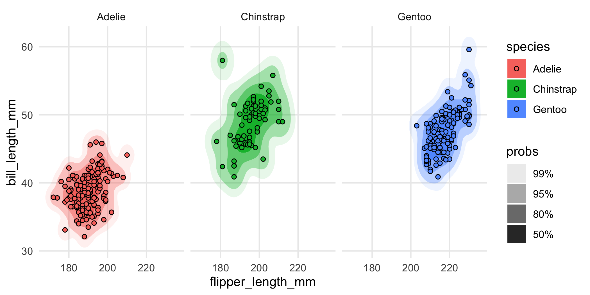
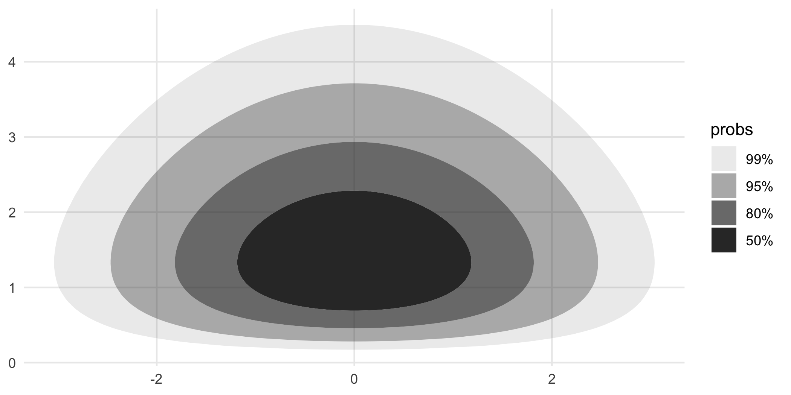
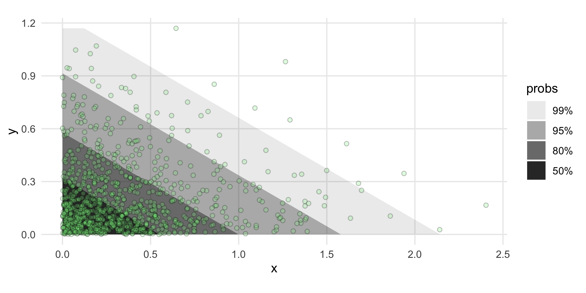

<!-- README.md is generated from README.Rmd. Please edit that file -->

# ggdensity 

<!-- badges: start -->

[](https://github.com/jamesotto852/ggdensity/actions)
[](https://cran.r-project.org/package=ggdensity)
[](https://cran.r-project.org/package=ggdensity)
<!-- badges: end -->

**ggdensity** extends
[**ggplot2**](https://github.com/tidyverse/ggplot2) providing more
interpretable visualizations of density estimates based on highest
density regions (HDRs). **ggdensity** offers drop-in replacements for
[**ggplot2**](https://github.com/tidyverse/ggplot2) functions:

-   `geom_hdr()` ↔ `geom_contour_2d_filled()`
-   `geom_hdr_lines()` ↔ `geom_contour_2d()`

Also included are the functions `geom_hdr_fun()` and
`geom_hdr_fun_lines()` for plotting HDRs of user-specified bivariate
probability density functions.

## Installation

You can install the development version of **ggdensity** from
[GitHub](https://github.com/) with:

``` r
if (!requireNamespace("remotes")) install.packages("remotes")
remotes::install_github("jamesotto852/ggdensity")
```

## Simple Examples

#### Comparing to `geom_contour_2d()`

Below, we plot density estimates of some simulated data using
`geom_density_2d_filled()` (left) and `geom_hdr()` (right). Both plots
show contours from the same density surface, but the contours plotted by
`geom_hdr()` are chosen to be inferentially relevant, showing the
smallest regions containing 50%, 80%, 95%, and 99% of the estimated
density (the HDRs). This results in a very interpretable graphic,
conveying more information than arbitrary density contours.

``` r
df <- data.frame("x" = rnorm(1000), "y" = rnorm(1000))

ggplot(df, aes(x, y)) + geom_density_2d_filled()

ggplot(df, aes(x, y)) + geom_hdr()
```


#### Grouping

Because `geom_hdr()` maps to the `alpha` aesthetic, the `fill` and
`color` aesthetics are available for mapping to variables. This allows
for easy comparison of HDRs between groups in a data set, below we
illustrate this with the `penguins` data from
[`palmerpenguins`](https://github.com/allisonhorst/palmerpenguins).

``` r
library("palmerpenguins")

ggplot(penguins, aes(flipper_length_mm, bill_length_mm, fill = species)) +
  geom_hdr(xlim = c(160, 240), ylim = c(30, 70)) +
  geom_point(shape = 21)
```


<div style="height:40px;">

</div>

To alleviate overplotting, we can use `geom_hdr_lines()` or facet:

``` r
ggplot(penguins, aes(flipper_length_mm, bill_length_mm, color = species)) +
  geom_hdr_lines(xlim = c(160, 240), ylim = c(30, 70)) +
  geom_point(size = .5)
```


<div style="height:40px;">

</div>

``` r
ggplot(penguins, aes(flipper_length_mm, bill_length_mm, fill = species)) +
  geom_hdr(xlim = c(160, 240), ylim = c(30, 70)) +
  geom_point(shape = 21) +
  facet_wrap(vars(species))
```



## More Examples

#### Mapping to different aesthetics

`geom_hdr()` and `geom_hdr_lines()` map the computed variable `level` to
the `alpha` aesthetic by default. This is easy to change via
`after_stat()`, just be sure to override the `alpha` aesthetic by
setting `alpha = 1`.

``` r
ggplot(faithful, aes(eruptions, waiting)) +
  geom_hdr(
    aes(fill = after_stat(level)), 
    alpha = 1, xlim = c(0, 8), ylim = c(30, 110)
  )

ggplot(faithful, aes(eruptions, waiting)) +
  geom_hdr_lines(
    aes(color = after_stat(level)), 
    alpha = 1, xlim = c(0, 8), ylim = c(30, 110)
  )
```


#### Different density estimators

Just like `geom_density_2d_filled()`, `geom_hdr()` allows for
visualizing kernel density estimates. It also allows for visualizing
HDRs resulting from parametric, histogram, and frequency polygon
estimates via the `method` argument. Each of these estimators offers
advantages in certain contexts. For example, histogram estimators result
in HDRs which obey constrained supports.


<!-- #### Bayesian applications -->
<!-- In the context of a Bayesian analysis, `geom_hdr()` creates plots of highest posterior regions. -->
<!-- All we need to do is give `geom_hdr()` a data frame with draws from a posterior, and  -->

## Plotting HDRs for abitrary pdfs with `geom_hdr_fun()`

`geom_hdr_fun()` and `geom_hdr_fun_lines()` compute and plot the HDRs of
an arbitrary bivariate pdf. These functions behave similarly to
`geom_function()` from
[**ggplot2**](https://github.com/tidyverse/ggplot2), accepting the
argument `fun` specifying the pdf to be summarized. Below, we have
illustrated this by plotting HDRs corresponding to the bivariate
standard normal distribution.

``` r
f <- function(x, y) dnorm(x) * dnorm(y)

ggplot() +
  geom_hdr_fun(fun = f, xlim = c(-3, 3), ylim = c(-3, 3)) +
  coord_fixed()
```



#### Visualizing parametric density estimates with `geom_hdr_fun()`

In addition to all of the methods of density estimation available with
`geom_hdr()`, `geom_hdr_fun()` allows for the plotting of parametrically
estimated HDRs corresponding to any user-specified data model. Below, we
have found the MLE estimates for the rates of a sample from the
bivariate exponential distribution and used `geom_hdr_fun()` to plot the
parametrically estimated HDRs.

``` r
df <- data.frame("x" = rexp(1000, 1), "y" = rexp(1000, 1))

# pdf for parametric density estimate
f <- function(x, y, lambda) dexp(x, lambda[1]) * dexp(y, lambda[2])

# estimate parameters governing joint pdf
lambda_hat <- apply(df, 2, mean)

# pass estimated density into geom_hdr_fun()
ggplot(df, aes(x, y)) +
  geom_hdr_fun(fun = f, args = list(lambda = lambda_hat)) +
  geom_point(size = .3) +
  coord_fixed()
```


