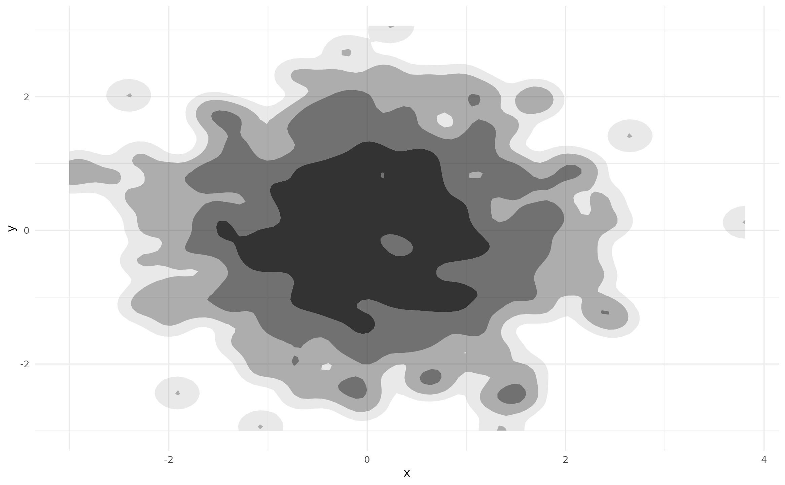

# The method argument

Almost every function in **ggdensity** accepts a `method` argument—this
is true for
[`geom_hdr()`](https://jamesotto852.github.io/ggdensity/reference/geom_hdr.md)
and other layer functions
([`geom_hdr_lines()`](https://jamesotto852.github.io/ggdensity/reference/geom_hdr.md),
[`geom_hdr_points()`](https://jamesotto852.github.io/ggdensity/reference/geom_hdr_points.md),
…), as well as
[`get_hdr()`](https://jamesotto852.github.io/ggdensity/reference/get_hdr.md)
and
[`get_hdr_1d()`](https://jamesotto852.github.io/ggdensity/reference/get_hdr_1d.md).
This vignette summarizes the many ways in which the `method` argument
can be specified; first looking at it from a more basic perspective,
then from the perspective of a developer wanting to implement additional
estimators.

## Using **ggdensity**’s `method_*()` functions

First, let’s load the necessary packages and generate some sample data.

``` r
library("ggdensity"); theme_set(theme_minimal(8))
#> Loading required package: ggplot2
theme_update(legend.position = "none") # Suppressing legends for readability
```

``` r
set.seed(1) 
df <- data.frame(x = rnorm(500), y = rnorm(500))
p <- ggplot(df, aes(x, y))
p + geom_point()
```


The easiest way to plot HDRs with
[`geom_hdr()`](https://jamesotto852.github.io/ggdensity/reference/geom_hdr.md)
(or any other layer function from **ggdensity**) with a specified
density estimator is to provide a character object to the `method`
argument:

``` r
p + geom_hdr(method = "kde")

p + geom_hdr(method = "mvnorm")

p + geom_hdr(method = "histogram")

p + geom_hdr(method = "freqpoly")
```


However, as of **ggdensity** v1.0.0 there is an alternative
approach—providing a `method_*()` function call:

``` r
p + geom_hdr(method = method_kde())

p + geom_hdr(method = method_mvnorm())

p + geom_hdr(method = method_histogram())

p + geom_hdr(method = method_freqpoly())
```


The default behaviors of these two approaches are the same and always
will be—in this way, they are completely interchangeable. However, the
`method_*()` function call is required to estimate HDRs with non-default
estimator parameters. For example, we can set the `adjust` parameter to
apply a multiplicative adjustment to the heuristically determined
bandwidth in
[`method_kde()`](https://jamesotto852.github.io/ggdensity/reference/method_kde.md)
(which itself uses the one computed by
[`MASS::bandwidth.nrd()`](https://rdrr.io/pkg/MASS/man/bandwidth.nrd.html)):

``` r
p + geom_hdr(method = method_kde(adjust = 1/2))
```



The relevant parameters for each method are documented in their
respective `?method_*` help pages. Note that these parameters can not be
provided to
[`geom_hdr()`](https://jamesotto852.github.io/ggdensity/reference/geom_hdr.md)
or
[`stat_hdr()`](https://jamesotto852.github.io/ggdensity/reference/geom_hdr.md)
and thus are not accessible if a character value is provided to
`method`.

The `method` argument of
[`get_hdr()`](https://jamesotto852.github.io/ggdensity/reference/get_hdr.md)
functions in the same way:

``` r
res <- get_hdr(df, method = method_kde(adjust = 1/2))

str(res)
#> List of 3
#>  $ df_est:'data.frame':  10000 obs. of  5 variables:
#>   ..$ x               : num [1:10000] -3.01 -2.94 -2.87 -2.8 -2.73 ...
#>   ..$ y               : num [1:10000] -3 -3 -3 -3 -3 ...
#>   ..$ fhat            : num [1:10000] 4.72e-17 1.30e-15 2.88e-14 5.16e-13 7.44e-12 ...
#>   ..$ fhat_discretized: num [1:10000] 2.00e-19 5.50e-18 1.22e-16 2.18e-15 3.15e-14 ...
#>   ..$ hdr             : num [1:10000] 1 1 1 1 1 1 1 1 1 1 ...
#>  $ breaks: Named num [1:5] 0.00422 0.01273 0.03024 0.07544 Inf
#>   ..- attr(*, "names")= chr [1:5] "99%" "95%" "80%" "50%" ...
#>  $ data  :'data.frame':  500 obs. of  3 variables:
#>   ..$ x             : num [1:500] -0.626 0.184 -0.836 1.595 0.33 ...
#>   ..$ y             : num [1:500] 0.0773 -0.2969 -1.1832 0.0113 0.9916 ...
#>   ..$ hdr_membership: num [1:500] 0.5 0.5 0.8 0.8 0.5 0.95 0.8 0.5 0.5 0.5 ...
```

For details on the output of
[`get_hdr()`](https://jamesotto852.github.io/ggdensity/reference/get_hdr.md),
see
[`?get_hdr`](https://jamesotto852.github.io/ggdensity/reference/get_hdr.md).

### `method_*_1d()` functions

In **ggdensity**, it is possible to estimate and plot 1-dimensional HDRs
with
[`geom_hdr_rug()`](https://jamesotto852.github.io/ggdensity/reference/geom_hdr_rug.md)
and
[`get_hdr_1d()`](https://jamesotto852.github.io/ggdensity/reference/get_hdr_1d.md).
These functions also accept a `method` argument, but they do not accept
the previously discussed `method_*()` functions. Instead they accept the
1-dimensional analogues: `method_*_1d()`.

``` r
p + 
  geom_point() +
  geom_hdr_rug(method = method_kde_1d())

p + 
  geom_point() +
  geom_hdr_rug(method = method_norm_1d())

p + 
  geom_point() +
  geom_hdr_rug(method = method_histogram_1d())

p + 
  geom_point() +
  geom_hdr_rug(method = method_freqpoly_1d())
```


Just like we saw with
[`geom_hdr()`](https://jamesotto852.github.io/ggdensity/reference/geom_hdr.md),
[`geom_hdr_rug()`](https://jamesotto852.github.io/ggdensity/reference/geom_hdr_rug.md)
also accepts character values for `method`:

``` r
p + 
  geom_point() +
  geom_hdr_rug(method = "kde")

p + 
  geom_point() +
  geom_hdr_rug(method = "norm")

p + 
  geom_point() +
  geom_hdr_rug(method = "histogram")

p + 
  geom_point() +
  geom_hdr_rug(method = "freqpoly")
```


Because the return values of the `method_*()` functions are incompatible
with the 1-dimensional HDR estimation procedure, if a 2-dimensional
method is specified the following error message is issued:

``` r
p + 
  geom_point() +
  geom_hdr_rug(method = method_kde()) 
#> Warning: Computation failed in `stat_hdr_rug()`.
#> Caused by error in `get_hdr_1d()`:
#> ! Invalid `method` argument -- did you forget the `_1d()`?
```

Lastly, we see that the `method` argument of
[`get_hdr_1d()`](https://jamesotto852.github.io/ggdensity/reference/get_hdr_1d.md)
behaves similarly.

``` r
res <- get_hdr_1d(df$x, method = method_kde_1d())

str(res)
#> List of 3
#>  $ df_est:'data.frame':  512 obs. of  4 variables:
#>   ..$ x               : num [1:512] -3.01 -2.99 -2.98 -2.97 -2.95 ...
#>   ..$ fhat            : num [1:512] 0.00727 0.00748 0.00768 0.00788 0.00808 ...
#>   ..$ fhat_discretized: num [1:512] 9.73e-05 1.00e-04 1.03e-04 1.05e-04 1.08e-04 ...
#>   ..$ hdr             : num [1:512] 1 1 1 1 1 1 1 1 1 1 ...
#>  $ breaks: Named num [1:5] 0.0188 0.0561 0.1599 0.3143 Inf
#>   ..- attr(*, "names")= chr [1:5] "99%" "95%" "80%" "50%" ...
#>  $ data  :'data.frame':  500 obs. of  2 variables:
#>   ..$ x             : num [1:500] -0.626 0.184 -0.836 1.595 0.33 ...
#>   ..$ hdr_membership: num [1:500] 0.5 0.5 0.8 0.95 0.5 0.8 0.5 0.8 0.5 0.5 ...
```

Again, for details on the above output of
[`get_hdr_1d()`](https://jamesotto852.github.io/ggdensity/reference/get_hdr_1d.md),
see
[`?get_hdr_1d`](https://jamesotto852.github.io/ggdensity/reference/get_hdr_1d.md).

## A detailed look at `method_*()` functions

Now that we understand the ways in which `method` can be specified let’s
look at the internals of the `method_*()` functions. Note: the
implementations discussed in this section depend heavily on topics in
functional programming, especially
[closures](https://adv-r.hadley.nz/environments.html?q=closures#function-environments)
and [function
factories](https://adv-r.hadley.nz/function-factories.html). While not
necessary, a good understanding of these ideas is helpful—the linked
chapters from Hadley Wickham’s *Advanced R* are a great place to start.

Looking at the definition of
[`method_kde()`](https://jamesotto852.github.io/ggdensity/reference/method_kde.md),
we see that it is a function of `h` and `adjust`, returning a closure
with arguments `data`, `n`, `rangex`, and `rangey`. The closure passes
the `x` and `y` columns of `data` to
[`MASS::kde2d()`](https://rdrr.io/pkg/MASS/man/kde2d.html), returning
the estimated density evaluated on a grid with columns `x`, `y`, and
`fhat`. This closure is what
[`geom_hdr()`](https://jamesotto852.github.io/ggdensity/reference/geom_hdr.md)
expects as its `method` argument, and is how the HDRs are estimated (via
[`get_hdr()`](https://jamesotto852.github.io/ggdensity/reference/get_hdr.md)).

``` r
method_kde
function (h = NULL, adjust = c(1, 1)) 
{
    function(data, n, rangex, rangey) {
        if (is.null(h)) {
            h <- c(MASS::bandwidth.nrd(data$x), MASS::bandwidth.nrd(data$y))
        }
        h <- h * adjust
        kdeout <- MASS::kde2d(x = data$x, y = data$y, n = n, 
            h = h, lims = c(rangex, rangey))
        df <- with(kdeout, expand.grid(x = x, y = y))
        df$fhat <- as.vector(kdeout$z)
        df
    }
}
<bytecode: 0x55d55a760c90>
<environment: namespace:ggdensity>
```

Both
[`method_histogram()`](https://jamesotto852.github.io/ggdensity/reference/method_histogram.md)
and
[`method_freqpoly()`](https://jamesotto852.github.io/ggdensity/reference/method_freqpoly.md)
behave similarly, accepting parameters governing the density estimation
procedure and returning a closure with arguments `data`, `n`, `rangex`,
and `rangey`. However, these functions are significantly more
complicated as the density estimation procedures are implemented
entirely in **ggdensity**.

[`method_mvnorm()`](https://jamesotto852.github.io/ggdensity/reference/method_mvnorm.md)
is different in a few ways. The closure it returns is a function of just
one argument: `data`. This is because it does not return the estimated
density evaluated on a grid. Instead, it returns yet another closure
with (vectorized) arguments `x` and `y`. As in
[`method_kde()`](https://jamesotto852.github.io/ggdensity/reference/method_kde.md),
the return value of the closure is a representation of the estimated
pdf. The difference is the manner in which the pdf is represented.
Whereas before we had a pdf defined by a discrete approximation on a
grid, we now have an explicit definition of the pdf in terms of `x` and
`y`.

``` r
method_mvnorm
function () 
{
    function(data) {
        data_matrix <- with(data, cbind(x, y))
        mu_hat <- colMeans(data_matrix)
        R <- chol(cov(data_matrix))
        function(x, y) {
            X <- cbind(x, y)
            tmp <- backsolve(R, t(X) - mu_hat, transpose = TRUE)
            logretval <- -sum(log(diag(R))) - log(2 * pi) - 0.5 * 
                colSums(tmp^2)
            exp(logretval)
        }
    }
}
<bytecode: 0x55d55dfb5e70>
<environment: namespace:ggdensity>
```

To summarize each of the above cases: in the first example, the
`method_*()` function returned a closure with arguments `data`, `n`,
`rangex`, and `rangey` which itself returned the estimated density
evaluated on a grid; in the second, the `method_*()` function returned a
closure with a single argument, `data`, which itself returned a closure
with arguments `x` and `y`, representing the estimated density
explicitly. In both cases, the `method_*()` function can have any number
of parameters governing the density estimation procedure.

These are the two ways the `method` argument may be specified. The first
is necessary for cases in which an explicit definition of the estimated
density is not computationally feasible (for example, KDEs). The second
is an easier option for the cases in which a closed form of the
estimated density is available (for example, parametric estimators).

Let’s look at how we might define our own `method_*()` functions in each
case, beginning with a simple parametric estimator.

### Implementing a method returning a PDF

In **ggdensity**,
[`method_mvnorm()`](https://jamesotto852.github.io/ggdensity/reference/method_mvnorm.md)
estimates HDRs based on the parametric multivariate normal model. If we
wanted to fit a simpler model in which the data is further assumed to be
independent, we could implement `method_mvnorm_ind()`.

``` r
method_mvnorm_ind <- function() {
  
  function(data) {
    
    xbar <- mean(data$x)
    ybar <- mean(data$y)
    
    sx <- sd(data$x)
    sy <- sd(data$y)
    
    # joint pdf is simply the product of the marginals
    function(x, y) dnorm(x, xbar, sx) * dnorm(y, ybar, sy)
  }
  
}
```

To use our `method_mvnorm_ind()`, we just need to supply it to
[`geom_hdr()`](https://jamesotto852.github.io/ggdensity/reference/geom_hdr.md)’s
`method` argument.

``` r
ggplot(df, aes(x, y)) +
  geom_hdr(method = method_mvnorm_ind())
```


If we transform our data to have non-zero covariance we still see the
major and minor axes of the contours coincide with the plot axes—exactly
what we would expect with this (incorrectly) constrained model.

``` r
A <- matrix(c(
  2*cos(pi/6), -2*sin(pi/6),
  1*sin(pi/6),  1*cos(pi/6)
), byrow = TRUE, ncol = 2)

df_rot <- as.data.frame(as.matrix(df) %*% A)
colnames(df_rot) <- c("x", "y")

ggplot(df_rot, aes(x, y)) +
  geom_hdr(method = method_mvnorm_ind()) +
  geom_point(size = .4) +
  coord_fixed(xlim = c(-6, 6), ylim = c(-6, 6))
```


Notice, `method_mvnorm_ind()` accepts no arguments. The density
estimation procedure is so simple that there are no parameters to govern
it. To allow for circular models in which the fitted variances are
required to be equal, we can implement a `circular` argument.

``` r
method_mvnorm_ind <- function(circular = FALSE) {
  
  function(data) {
    
    xbar <- mean(data$x)
    ybar <- mean(data$y)
    
    if (circular) {
      sx <- sd(c(data$x - xbar, data$y - ybar))
      sy <- sx
    } else {
      sx <- sd(data$x)
      sy <- sd(data$y)
    }
    
    function(x, y) dnorm(x, xbar, sx) * dnorm(y, ybar, sy)
  }
  
}
```

Now, the contours are perfectly circular.

``` r
ggplot(df_rot, aes(x, y)) +
  geom_hdr(method = method_mvnorm_ind(circular = TRUE)) +
  geom_point(size = .4) +
  coord_fixed(xlim = c(-6, 6), ylim = c(-6, 6))
```


In the above plot, the upper and lower portions of the HDRs are cut off.
This is because the default behavior of **ggdensity** is to not draw
HDRs outside of the “bounding box” around observed data. This is *not*
because we are using a custom `method_*()` function. To fix this, we
need to either set a better `ylim` value for
[`geom_hdr()`](https://jamesotto852.github.io/ggdensity/reference/geom_hdr.md)
or specify a larger range in
[`scale_y_continuous()`](https://ggplot2.tidyverse.org/reference/scale_continuous.html).

``` r
ggplot(df_rot, aes(x, y)) +
  geom_hdr(method = method_mvnorm_ind(circular = TRUE), ylim = c(-6, 6)) +
  geom_point(size = .4) +
  coord_fixed(xlim = c(-6, 6), ylim = c(-6, 6))

ggplot(df_rot, aes(x, y)) +
  geom_hdr(method = method_mvnorm_ind(circular = TRUE)) +
  geom_point(size = .4) +
  scale_y_continuous(limits = c(-6, 6)) +
  coord_fixed(xlim = c(-6, 6), ylim = c(-6, 6))
```


Notice, neither of these approaches involve arguments to
`method_mvnorm_ind()`. Internally, the closure returned by
`method_mvnorm_ind()` is used by
[`get_hdr()`](https://jamesotto852.github.io/ggdensity/reference/get_hdr.md),
along with information from the `scales` associated with the `ggplot`
object. It is the `scales` that need adjusting, not anything related to
the `method` argument.

### Implementing a method returning an evaluated PDF

To illustrate the other case, in which the object returned by the
closure is the estimated density evaluated on a grid, we implement
`method_mvnorm_ind_grid()`. This estimates the same independent normal
density as `method_mvnorm_ind()`, the only difference is the behavior of
the returned closure.

``` r
method_mvnorm_ind_grid <- function() {
  
  function(data, n, rangex, rangey) {
    
    # First, we estimate the density -----------------------------
    
    xbar <- mean(data$x)
    ybar <- mean(data$y)
    
    sx <- sd(data$x)
    sy <- sd(data$y)
    
    f_est <- function(x, y) dnorm(x, xbar, sx) * dnorm(y, ybar, sy)
    
    
    # Return the density evaluated on a grid ---------------------
    
    # df_grid defined by rangex, rangey, and n
    df_grid <- expand.grid(
      x = seq(rangex[1], rangex[2], length.out = n),
      y = seq(rangey[1], rangey[2], length.out = n)
    )
    
    df_grid$fhat <- f_est(df_grid$x, df_grid$y)
    
    df_grid
  }
  
}
```

See that returned closure has additional arguments `n`, `rangex`, and
`rangey` which define the grid. Also, the grid is represented a
`data.frame` with columns `x`, `y`, and `fhat`, where `fhat` is the
(potentially unnormalized) density estimate.

Again, to use our `method_mvnorm_ind_grid()` we provide it to
[`geom_hdr()`](https://jamesotto852.github.io/ggdensity/reference/geom_hdr.md)’s
method argument.

``` r
ggplot(df, aes(x, y)) +
  geom_hdr(method = method_mvnorm_ind_grid())
```


Like we saw in the previous example, we could prevent the HDRs from
being “cut off” by specifying either the `x/ylim` arguments in
[`geom_hdr()`](https://jamesotto852.github.io/ggdensity/reference/geom_hdr.md)
or by setting a larger range in `scale_x/y_continuous()`.

## The `method_*_1d()` functions

We saw before that **ggdensity** uses `method_*_1d()` functions for the
estimation of 1-dimensional densities. The internals of these functions
are very similar to the `method_*()` functions, the only differences are
slight changes to the arguments and return values of the returned
closures.

Looking at the definition of
[`method_kde_1d()`](https://jamesotto852.github.io/ggdensity/reference/method_kde_1d.md),
we see the returned closure has arguments `x`, `n`, and `range`. This is
very similar to
[`method_kde()`](https://jamesotto852.github.io/ggdensity/reference/method_kde.md),
the only difference is we are now dealing with univariate data: the
vector argument `x` is used instead of `data`, and we have a single
`range` parameter instead of `rangex` and `rangey`. Similarly, the
closure now returns the estimated density evaluated on a univariate
grid, with columns `x` and `fhat` instead of the bivariate grid with
columns `x`, `y`, and `fhat`. Finally, see that
[`method_kde_1d()`](https://jamesotto852.github.io/ggdensity/reference/method_kde_1d.md)
accepts several arguments governing the density estimation procedure
just like
[`method_kde()`](https://jamesotto852.github.io/ggdensity/reference/method_kde.md).

``` r
method_kde_1d
function (bw = "nrd0", adjust = 1, kernel = "gaussian", weights = NULL, 
    window = kernel) 
{
    function(x, n, range) {
        nx <- length(x)
        if (is.null(weights)) {
            weights <- rep(1/nx, nx)
        }
        else {
            weights <- normalize(weights)
        }
        dens <- stats::density(x, bw = bw, adjust = adjust, kernel = kernel, 
            weights = weights, window = window, n = n, from = range[1], 
            to = range[2])
        data.frame(x = dens$x, fhat = dens$y)
    }
}
<bytecode: 0x55d55c562558>
<environment: namespace:ggdensity>
```

Estimated univariate densities can also be represented explicitly, as
illustrated by
[`method_norm_1d()`](https://jamesotto852.github.io/ggdensity/reference/method_norm_1d.md).
Comparing this to the previously discussed
[`method_mvnorm()`](https://jamesotto852.github.io/ggdensity/reference/method_mvnorm.md)
we see that little has changed: the closure is now a function of a
vector `x` instead of `data` and returns a function of one variable
(`x`) instead of two (`x` and `y`).

``` r
method_norm_1d
function () 
{
    function(x) {
        mu_hat <- mean(x)
        sigma_hat <- sd(x)
        function(x) dnorm(x, mu_hat, sigma_hat)
    }
}
<bytecode: 0x55d55c882838>
<environment: namespace:ggdensity>
```

Additional `method_*_1d()` functions can be implemented in the same way
as the 2-dimensional `method_*()` functions, so long as the returned
closure is structured in one of the two ways we have seen here.
